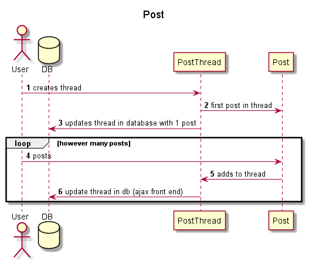
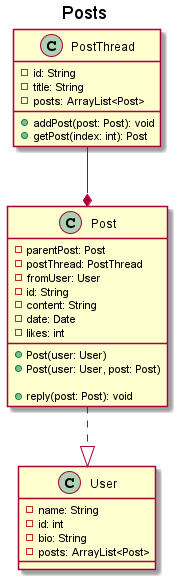

# Libratum Design Document

## Instructions

Forum app

## *Project Title* Design

## 1. Problem Statement

Create a forum for wine enthusiasts where they can post and discuss different wines they are trying in order to
make it easier to discover new wine products and pairings for them. Also providing more knowledge for finding wine online

## 2. Top Questions to Resolve in Review

*List the most important questions you have about your design, or things that
you are still debating internally that you might like help working through.*

1. How to implement an API into the project   
2. What will mvp look like?
3. How to build upon the app to have features outside of the unit

## 3. Use Cases

U1. As a forum customer, I want to post when I create an account

U2. I would like to reply to posts / add to threads and interact with the community

U3. I would like to add wines that are not already there

U4. I would like a product recommendation/rating system

U5. I would like a small tight-knit community of fellow wine enthusiasts

U6. I would like to sign up for an email newsletter

## 4. Project Scope

### 4.1. In Scope

    1.) Account Creation and bare-bones security (need account to post)
    2.) To create threads with post
    3.) To add to threads / reply
    4.) Implement recommendation / rating system

### 4.2. Out of Scope

    1.) newsletter
    2.) subscription service

# 5. Proposed Architecture Overview

Springboot with JSP pages, web app





# 6. API

## 6.1. Public Models

Why?

## 6.2. *First Endpoint*

* accepts `GET` from /forum

* accepts ``


## 6.3 *Second Endpoint*

*(repeat, but you can use shorthand here, indicating what is different, likely
primarily the data in/out and error conditions. If the sequence diagram is
nearly identical, you can say in a few words how it is the same/different from
the first endpoint)*

# 7. Tables

1. POSTTHREAD
2. POST
3. USER
4. WINE

## Data Model
This section maps the attributes of our tables, with the corresponding DDB type.

```markdown
    post_thread
  
    id // partition key, string
    title // string
    post // list
    
```

```markdown
    posts
  
    parentPost // partition key, Post
    postThread // PostThread
    fromUser // User
    id// string
    content// string
    date// date
    likes// int

```

```markdown
    users
  
    id // partition key, int
    name // string
    bio // string
    posts// list

```


# 8. Pages

*Include mock-ups of the web pages you expect to build. These can be as
sophisticated as mockups/wireframes using drawing software, or as simple as
hand-drawn pictures that represent the key customer-facing components of the
pages. It should be clear what the interactions will be on the page, especially
where customers enter and submit data. You may want to accompany the mockups
with some description of behaviors of the page (e.g. “When customer submits the
submit-dog-photo button, the customer is sent to the doggie detail page”)*
